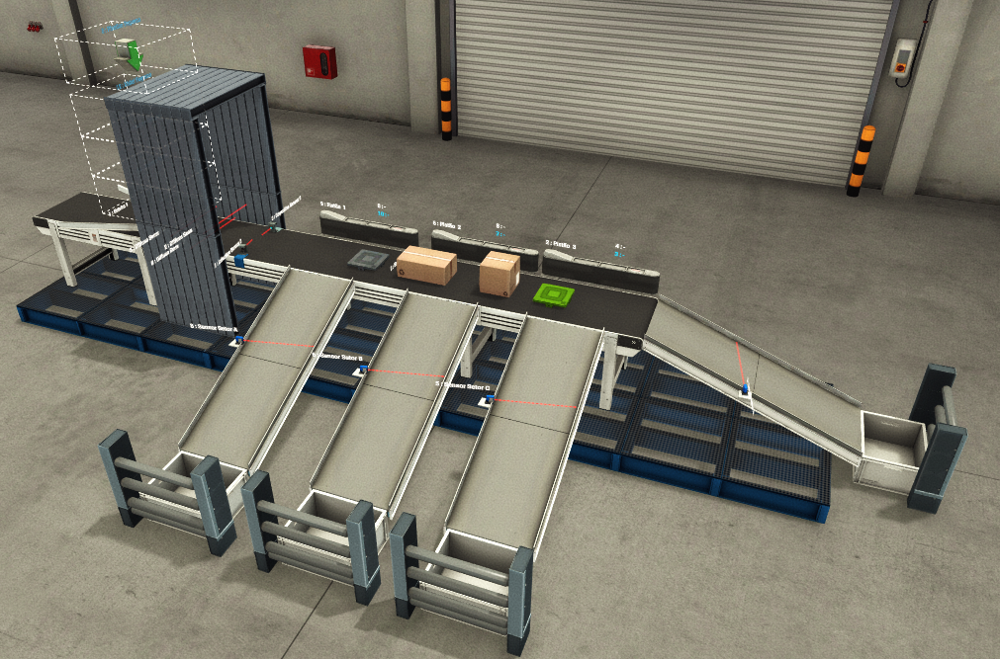
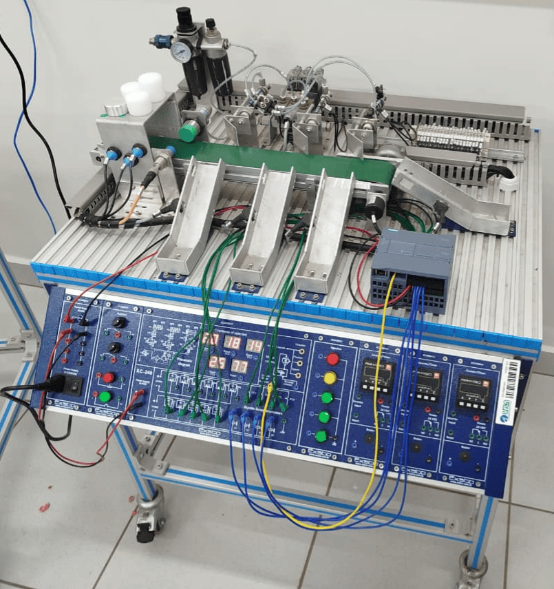
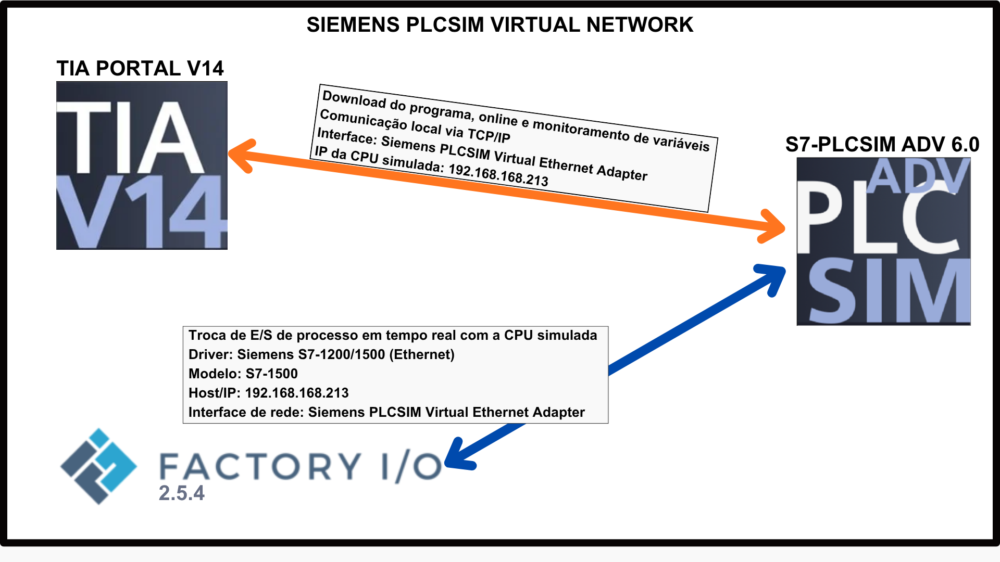
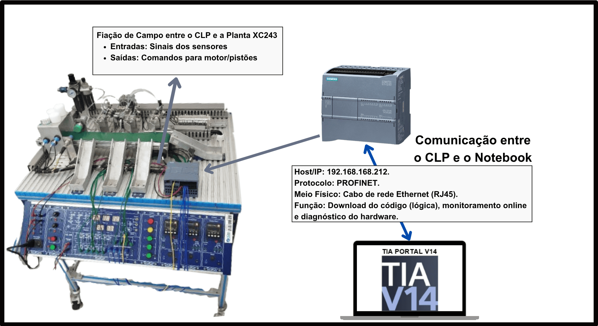

# Gêmeo Digital da Bancada XC243 com Factory I/O

[](https://creativecommons.org/licenses/by/4.0/)
[](https://www.siemens.com)
[](https://www.siemens.com)
[](https://factoryio.com)
[](https://www.siemens.com)

> Repositório oficial do Trabalho de Conclusão de Curso (TCC) que apresenta o desenvolvimento e a validação de um **Gêmeo Digital** para comissionamento virtual da bancada didática **EXSTO XC243** (processo de seleção de peças por material e altura).

---

## 📑 Sumário

- [Visão Geral](#-visão-geral)
- [Arquitetura do Projeto](#️-arquitetura-do-projeto)
- [Demonstração em Vídeo](#-demonstração-em-vídeo)
- [Galeria de Screenshots](#️-galeria-de-screenshots)
- [Estrutura do Repositório](#-estrutura-do-repositório)
- [Requisitos](#️-requisitos)
- [Como Executar](#️-como-executar)
- [Resultados Obtidos](#-resultados-obtidos)
- [Trabalho Acadêmico](#-trabalho-acadêmico)
- [Citação](#-citação)
- [Autor](#‍-autor)
- [Licença](#-licença)

---

## 🎯 Visão Geral

Este projeto implementa um Gêmeo Digital da bancada didática **XC243 (EXSTO Tecnologia)** utilizando o ambiente de simulação 3D **Factory I/O** integrado a um controlador Siemens via técnica **Software-in-the-Loop (SIL)**. O sistema reproduz virtualmente uma esteira transportadora com classificação automática de peças por material (metálico/não metálico) e altura (pequena/média/grande), permitindo o desenvolvimento, depuração e validação de lógicas de controle antes da implementação em hardware real.

### Objetivos

- Construir um modelo virtual fidedigno da planta XC243 no Factory I/O
- Desenvolver lógica de controle modular em Ladder (norma IEC 61131-3)
- Validar o software em ambiente SIL com S7-PLCSim Advanced (CPU S7-1511-1 PN)
- Transferir o programa validado para CLP físico S7-1200 conectado à bancada
- Comparar o desempenho do Gêmeo Digital com o sistema físico através de quatro métricas formais

---

## 🏗️ Arquitetura do Projeto

```
┌─────────────────────────────────────────────────────────────────┐
│                         FASE I (Virtual)                         │
│                                                                  │
│   ┌──────────────┐    ┌──────────────┐    ┌──────────────────┐ │
│   │  Factory I/O │◄──►│  PLCSim Adv. │◄──►│   TIA Portal V14 │ │
│   │  (Planta)    │    │  (S7-1511-1) │    │   (Engenharia)   │ │
│   └──────────────┘    └──────────────┘    └──────────────────┘ │
│         Protocolo S7 sobre TCP/IP via Adaptador Virtual         │
└─────────────────────────────────────────────────────────────────┘
                              │
                              ▼  Migração do software (apenas 2 ajustes)
┌─────────────────────────────────────────────────────────────────┐
│                       FASE II (Hardware Real)                    │
│                                                                  │
│   ┌──────────────┐    ┌──────────────┐    ┌──────────────────┐ │
│   │ Bancada XC243│◄──►│  CLP S7-1200 │◄──►│   TIA Portal V14 │ │
│   │  (Planta)    │    │   + SB 1232  │    │   (Engenharia)   │ │
│   └──────────────┘    └──────────────┘    └──────────────────┘ │
│              Fiação elétrica de sensores e atuadores             │
└─────────────────────────────────────────────────────────────────┘
```

---

## 🎬 Demonstração em Vídeo

[**▶️ Assista no YouTube: Gêmeo Digital e bancada física operando em sincronismo**](https://youtube.com/shorts/fWso9KItnPY)

> O vídeo mostra a execução simultânea do modelo virtual (Factory I/O) e da bancada XC243 controlados pelo mesmo programa do TIA Portal.

---

## 🖼️ Galeria de Screenshots

### Cenário Virtual no Factory I/O

<p align="center">
  
  <br>
  <em>Figura 1 — Vista geral do Gêmeo Digital da bancada XC243 no Factory I/O.</em>
</p>

### Bancada Física XC243

<p align="center">
  
  <br>
  <em>Figura 2 — Bancada didática XC243 da EXSTO Tecnologia, com esteira transportadora, sensores e atuadores pneumáticos.</em>
</p>

### Comunicação na Fase I (Software-in-the-Loop)

<p align="center">
  
  <br>
  <em>Figura 3 — Arquitetura de comunicação na Fase I: Factory I/O integrado ao S7-PLCSim Advanced via TIA Portal.</em>
</p>

### Comunicação na Fase II (Hardware Real)

<p align="center">
  
  <br>
  <em>Figura 4 — Arquitetura de comunicação na Fase II: bancada XC243 conectada diretamente ao CLP S7-1200 via fiação elétrica.</em>
</p>

---
## 📁 Estrutura do Repositório

```
digital-twin-xc243-factoryio/
│
├── README.md                          # Este arquivo
├── LICENSE                            # Licença CC BY 4.0
├── CITATION.cff                       # Metadados para citação acadêmica
├── .gitignore                         # Arquivos ignorados pelo Git
│
├── factoryio/
│   └── Esteira Exsto XC243 - Digital Twin.factoryio
│
├── tia_portal/
│   ├── DigitalTwin_Selecao_de_Pecas.ap14
│   └── README.md                      # Instruções específicas do projeto TIA
│
└── docs/
    ├── arquitetura.md                 # Detalhamento técnico da arquitetura
    └── screenshots/                   # Imagens do projeto
```

---

## ⚙️ Requisitos

### Software

| Ferramenta | Versão | Função |
|---|---|---|
| **TIA Portal** | V14 ou superior | Programação do CLP e configuração de hardware |
| **S7-PLCSim Advanced** | V6.0 | Emulação da CPU S7-1511-1 PN |
| **Factory I/O** | 2.5.4 ou superior | Simulação 3D do Gêmeo Digital |
| **Sistema Operacional** | Windows 10/11 | Plataforma hospedeira (com virtualização habilitada) |

### Hardware Mínimo Recomendado

- **Processador:** Intel Core i5 (8ª geração) ou equivalente, com suporte a virtualização
- **Memória RAM:** 8 GB (16 GB recomendado para execução simultânea sem gargalos)
- **Armazenamento:** 5 GB livres para instalação das ferramentas
- **Rede:** Adaptador Ethernet (real ou virtual via PLCSim Virtual Ethernet Adapter)

### Hardware para Validação Física (Fase II)

- **CLP:** Siemens SIMATIC S7-1200 CPU 1214C DC/DC/DC (6ES7214-1AG40-0XB0)
- **Módulo de expansão:** Signal Board SB 1232 AQ (6ES7232-4HA30-0XB0)
- **Bancada:** EXSTO XC243 — Banco de Ensaios para Processo de Manufatura
- **Conexão:** Cabo PROFINET (Ethernet RJ45) entre notebook e CLP

---

## ▶️ Como Executar

### Fase I — Comissionamento Virtual (SIL)

1. **Instale os softwares** listados na seção de requisitos.
2. **Abra o projeto TIA Portal:**
   - No TIA Portal V14, vá em `Project → Open` e selecione `tia_portal/DigitalTwin_Selecao_de_Pecas.ap14`.
3. **Inicie o S7-PLCSim Advanced:**
   - Crie uma nova instância **PLCSIM Virtual Eth. Adapter** com IP `192.168.168.213` (ou o IP configurado no projeto).
   - Faça o download do programa do TIA Portal para a instância emulada.
4. **Abra o cenário no Factory I/O:**
   - Em `File → Open Scene`, selecione `factoryio/Esteira Exsto XC243 - Digital Twin.factoryio`.
5. **Configure o driver de I/O:**
   - Em `File → Drivers`, selecione **Siemens S7-1200/1500**.
   - No campo **Network adapter**, escolha **Siemens PLCSIM Virtual Ethernet Adapter**.
   - No campo **Host**, insira o IP da instância PLCSim (ex.: `192.168.168.213`).
   - Clique em **Connect**.
6. **Inicie a simulação:**
   - Pressione `F5` no Factory I/O para rodar a cena.
   - Coloque o CLP virtual em **RUN** pelo TIA Portal.
   - Insira peças no emissor para iniciar a triagem automática.

### Fase II — Implementação Física

1. **Conecte o notebook ao CLP S7-1200** via cabo Ethernet.
2. **No TIA Portal**, adicione um novo dispositivo com a CPU **S7-1200 CPU 1214C** e copie integralmente os blocos do projeto SIL.
3. **Ajustes necessários:**
   - Endereço da saída analógica `%QW` para o mapeamento da SB 1232.
   - Tipo de dado da referência de velocidade: trocar `Real (2.0)` por `UInt (27648)` correspondente à tensão máxima de 10 V.
4. **Faça o download** do programa para o CLP físico.
5. **Coloque o CLP em RUN** e teste a operação com peças reais na bancada XC243.

---

## 📊 Resultados Obtidos

A validação foi conduzida com base em **quatro métricas formais** e os principais resultados foram:

| Métrica | Critério | Fase I (Virtual) | Fase II (Física) | Resultado |
|---|---|---|---|---|
| **Conformidade de I/O** | Divergência zero | 14/14 sinais OK | 14/14 sinais OK | ✅ Atendido |
| **Taxa de Classificação Correta (TCC)** | 100% | 40/40 peças | 40/40 peças | ✅ Atendido |
| **Fidelidade Temporal** | Erro relativo < 20% | — | 3 de 4 percursos: 0,2–6,0% | ⚠️ Parcial (24,4% no Despacho) |
| **Portabilidade da Lógica** | Sem alteração na lógica de decisão | — | Apenas 2 ajustes pontuais | ✅ Atendido |

### Destaques

- **Duas falhas de lógica** identificadas e corrigidas inteiramente no ambiente virtual (race condition entre atuadores e classificação dimensional por temporização).
- **Migração entre famílias de CLP** (S7-1500 → S7-1200) exigiu apenas dois ajustes: endereçamento de hardware e tipo de dado da referência analógica.
- **80 peças processadas no total** (40 por fase) sem erros de classificação.

---

## 📖 Trabalho Acadêmico

A monografia completa do TCC estará disponível, em breve, no **Repositório Institucional da UFLA**:

[🔗 Acessar TCC no Repositório UFLA](http://repositorio.ufla.br) <!-- Substitua pelo link direto após depósito -->

---

## 📚 Citação

Se este trabalho for útil em sua pesquisa ou projeto, por favor cite:

### ABNT (NBR 6023)

> SALVADOR, G. **Gêmeo Digital utilizando Factory I/O para a planta XC243**. 2026. Trabalho de Conclusão de Curso (Engenharia de Controle e Automação) — Universidade Federal de Lavras, Lavras, 2026.

### BibTeX

```bibtex
@mastersthesis{salvador2026gemeo,
  author       = {Guilherme Salvador},
  title        = {Gêmeo Digital utilizando Factory I/O para a planta XC243},
  school       = {Universidade Federal de Lavras},
  year         = {2026},
  type         = {Trabalho de Conclusão de Curso},
  address      = {Lavras, MG, Brasil},
  url          = {https://github.com/guilhermehs00/digital-twin-xc243-factoryio}
}
```

---

## 👨‍💻 Autor

**Guilherme Salvador**

Engenharia de Controle e Automação — Universidade Federal de Lavras (UFLA)

[](https://github.com/guilhermehs00)

---

## 📜 Licença

Este projeto está licenciado sob a **Creative Commons Attribution 4.0 International (CC BY 4.0)**.

Você pode compartilhar e adaptar o material, desde que **atribua o devido crédito** ao autor original. Veja o arquivo [LICENSE](LICENSE) para os termos completos ou acesse [creativecommons.org/licenses/by/4.0](https://creativecommons.org/licenses/by/4.0/deed.pt-br).

---

<p align="center">
  <em>Desenvolvido como parte do TCC do curso de Engenharia de Controle e Automação da UFLA — 2026.</em>
</p>
